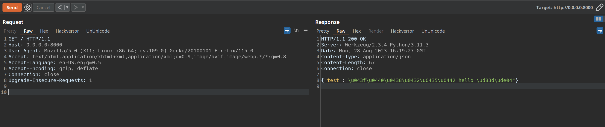
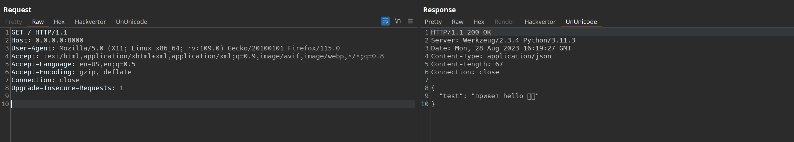
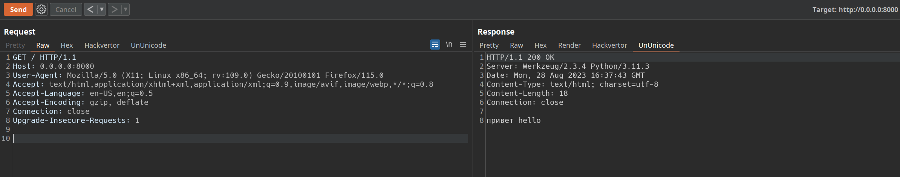

## UnUnicode

Burp extention for unescaping unicode-escaped sequences. Idea taken from [u2c](https://github.com/bit4woo/u2c), but this plugin won't work in my burp.

Wroten with burp suite montoya api and supports websockets.

## Example

You may notice that double-byte characters such as emojis are not converted correctly, but this is enough for my routine tasks.





It works with any content type, but pretty print implemented to json only:



## Install

```bash
mvn clean install
# install target/ununicode-1.3-jar-with-dependencies.jar
# in your burp extentions
```
